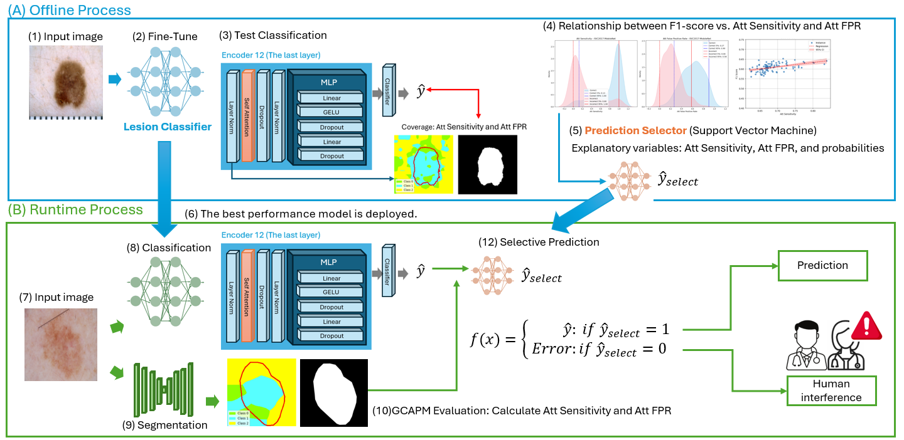

 

# SafeML: Skin Lesion Classification with Global Class Activation Mapping Evaluation
Recent advancements in skin lesion classification models have significantly improved accuracy, with some models even surpassing dermatologists' diagnostic performance. However, in medical practice, distrust in AI models remains a challenge. Beyond high accuracy, trustworthy, explainable diagnoses are essential. Existing explainability methods have reliability issues, with LIME-based methods suffering from inconsistency, while CAM-based methods failing to consider all classes. To address these limitations, we propose Global Class Activation Probabilistic Map Evaluation, a method that analyses all classes' activation probability maps probabilistically and at a pixel level. By visualizing the diagnostic process in a unified manner, it helps reduce the risk of misdiagnosis. Furthermore, the application of SafeML enhances the detection of false diagnoses and issues warnings to doctors and patients as needed, improving diagnostic reliability and ultimately patient safety. We evaluated our method using the ISIC datasets with MobileNetV2 and Vision Transformers.

