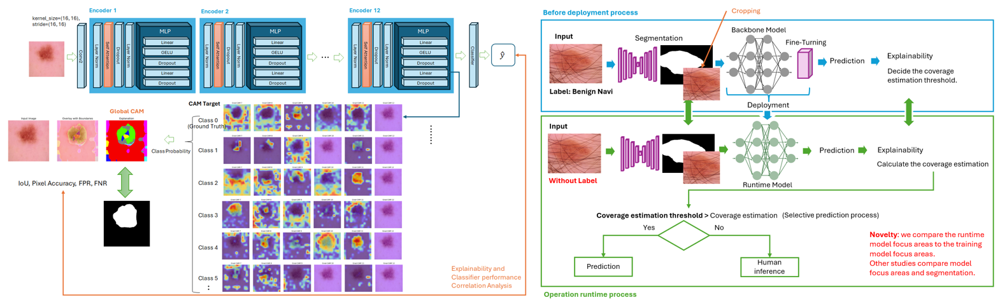

 

# SafeML: Skin Lesion Classification with Global Class Activation Mapping Evaluation
In recent years, the accuracy of skin lesion classification models has improved dramatically, and it has been reported that some models exceed the accuracy of dermatologists' diagnoses. However, in medical practice, there is a problem of distrust in models, and there is a need for not only high accuracy but also trustworthy diagnosis. Existing explainability methods (CAM and LIME) have reliability issues, and in particular, LIME has problems with a lack of consistency and Grad-CAM does not consider all classes. Therefore, we propose “Global Class Activation Probabilistic Mapping Evaluation.” In this method, the activation probability map of all classes is analyzed probabilistically and pixel-wise. This allows us to visualize the diagnostic process in a unified manner and reduce the risk of misdiagnosis. In addition, by applying the concept of safeML, we detect abnormal diagnoses and issue warnings to doctors and patients as needed. This method improves the safety and reliability of diagnosis and contributes to reducing the risk of self-diagnosis and supporting doctors' diagnoses. We used the ISIC 2016 and 2018 datasets and Vision Transformers for evaluation.

